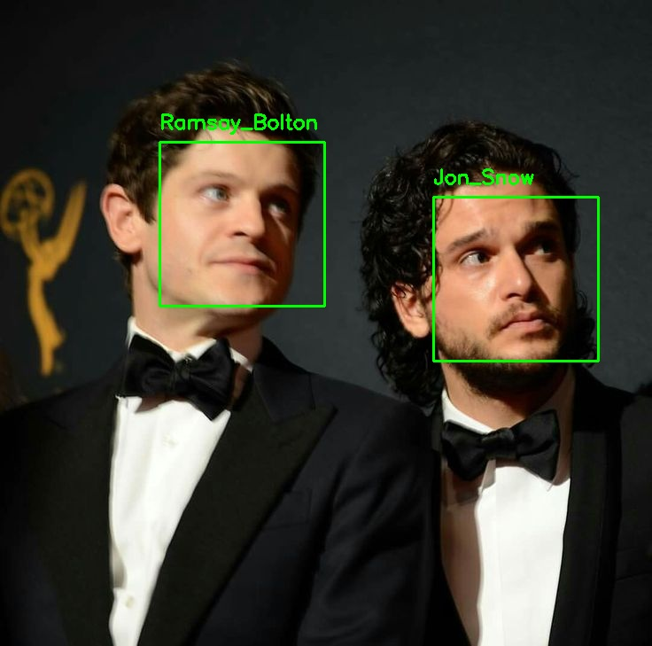
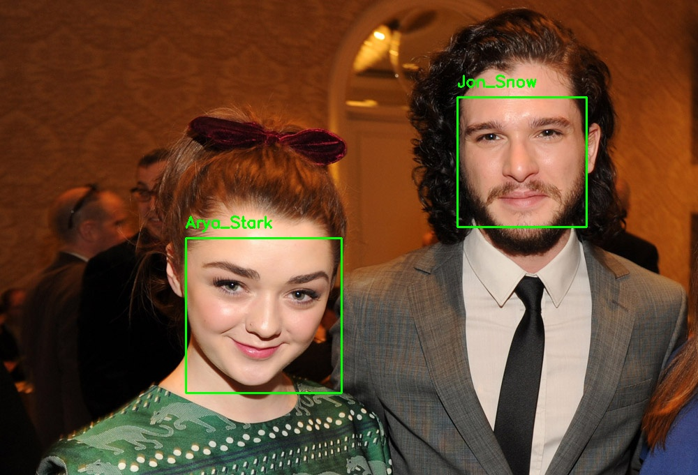
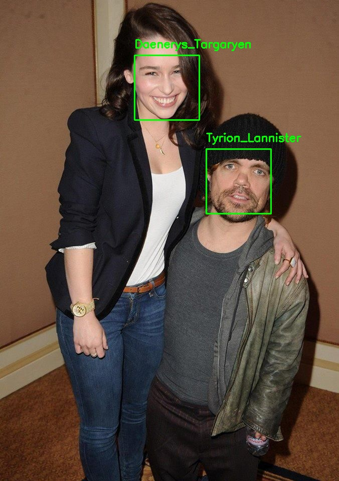

# Face-Recognition-using-dlib
Recognizing faces of "Game of Thrones" Character

## This is fun project I did to learn about face recognition and because I was missing GOT episodes :-(

## Following blogs helped me to complete this project and to learn about face recognition
- **[Pyimagesearch blog](https://www.pyimagesearch.com/2018/06/18/face-recognition-with-opencv-python-and-deep-learning/)**
- **[Medium blog](https://medium.com/@ageitgey/machine-learning-is-fun-part-4-modern-face-recognition-with-deep-learning-c3cffc121d78)**

**Link to Dataset - [Google Drive Link](https://drive.google.com/open?id=1Kqa_vtmORZWk7yNdEf1aFE6GAij9s9d0)**

### **Note: You can also run dataset.py to create your own dataset.**
- **[Pyimagesearch blog](https://www.pyimagesearch.com/2018/04/09/how-to-quickly-build-a-deep-learning-image-dataset/)**

This project directory contains following files:
- dataset.py - used to create your own dataset
- face_encoding.py - used to create encoding for faces in dataset
- recognize_faces.py - used to test and recognize faces

## Steps to follow

### Step 1: Create a directory named "dataset" and various sub-directories inside it with the names of people whose face you want to recognize. Run following command for various characters of Game of Thrones:
> python dataset.py --query "Jon Snow" --output dataset/Jon_Snow

### Step 2: Run following command to create encodings of all the faces. At last, it will save a serialized database containing encodings of various faces which will be used in the next step.
> python face_encoding.py --dataset dataset --encodings encodings.pickle

### Step 3: Run following command to recognize faces from "test" directory. Recognized faces will be saved in the "results" directory and are shown below.
> python recognize_faces.py --image test/pic1.jpg

## Results

